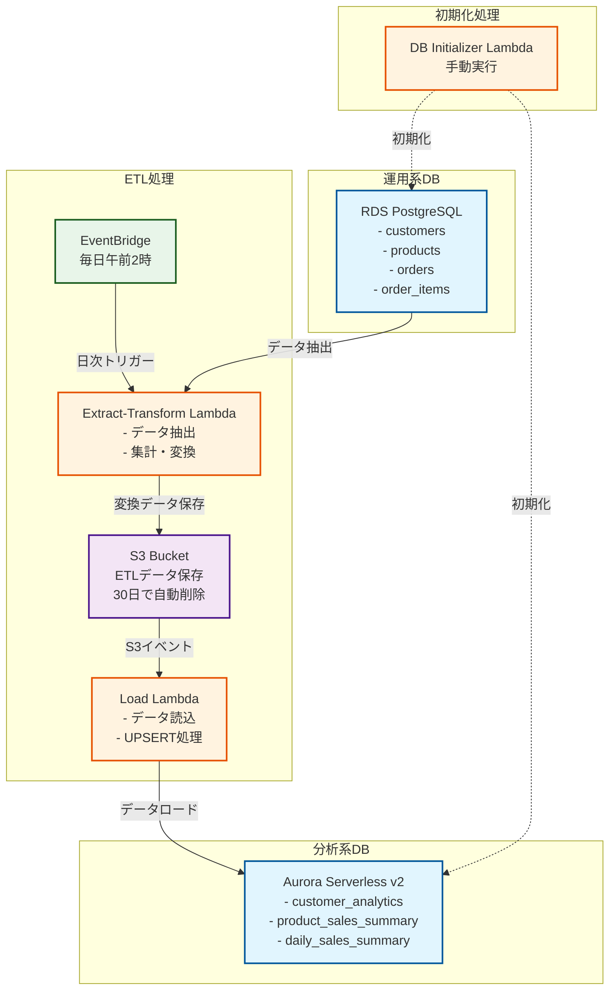
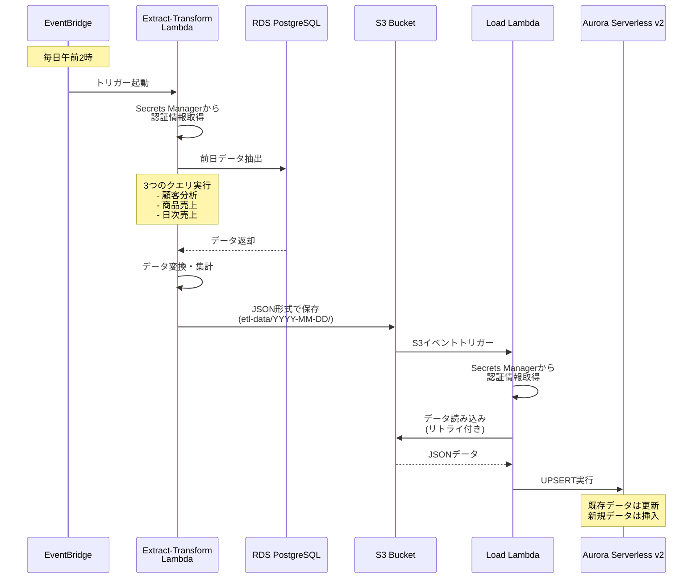
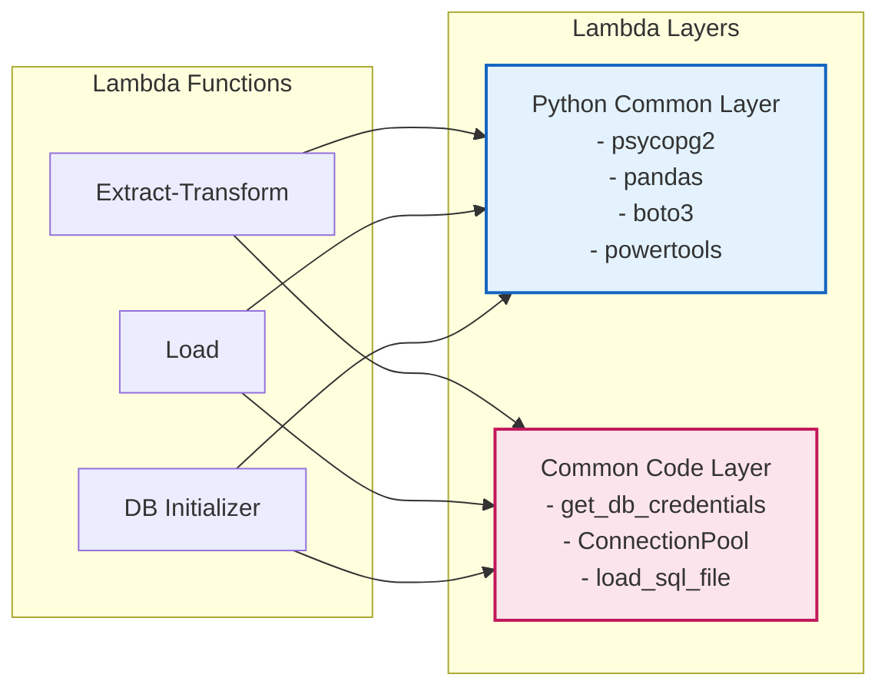

# DB ETL Lambda CDK Project

PostgreSQL間のETL処理をLambdaで実行するCDKプロジェクトです。

## 主な改善機能

- **セキュアな認証**: Secrets Managerを使用し、パスワードを環境変数に保存しない
- **Lambda Powertools**: 構造化ログ、メトリクス実装
- **Lambda Layer**: 2つのLayerで共通コードと依存関係を管理
  - Python Common Layer: 外部ライブラリ（psycopg2、pandas、boto3、powertools）
  - Common Code Layer: 共通コード（DB接続、認証情報取得、SQLファイル読み込み）
- **SQL分離**: SQLをファイル化して可読性・メンテナンス性向上
- **DB接続プール**: 接続管理とタイムアウト設定
- **リトライ機構**: S3読み込み時の指数バックオフ
- **S3ライフサイクル**: 30日経過したETLデータを自動削除

## アーキテクチャ

### 全体構成図



### 詳細処理フロー



### Lambda Layer構成



## 構成要素

- **ソースDB**: RDS PostgreSQL (運用系データ)
- **ターゲットDB**: Aurora Serverless v2 PostgreSQL (分析系データ)
- **ETL処理**: 3つのLambda関数
  - Extract-Transform Lambda: RDSからデータ抽出・変換、S3保存
  - Load Lambda: S3からデータ読み込み、Aurora挿入
  - DB Initializer Lambda: 手動実行によるDB初期化
- **ストレージ**: S3バケット (中間データ保存)
- **スケジューリング**: EventBridge (毎日午前2時実行)
- **セキュリティ**: VPC、Secrets Manager、IAMロール

## データフロー

### ソースDB（運用系）
- `customers`: 顧客情報
- `products`: 商品情報  
- `orders`: 注文情報
- `order_items`: 注文明細

### ターゲットDB（分析系）
- `customer_analytics`: 顧客別集計データ
- `product_sales_summary`: 商品別日次売上
- `daily_sales_summary`: 地域別日次売上

## セットアップ

### 1. 依存関係のインストール
```bash
npm install
```

### 2. CDKのデプロイ
```bash
# CDKのブートストラップ（初回のみ）
npx cdk bootstrap

# スタックのデプロイ
npx cdk deploy
```

### 3. データベースのセットアップ

デプロイ完了後、以下のコマンドでデータベースを初期化してください：

```bash
# DBが起動するまで少し待機（数分）
# その後、DB初期化Lambda関数を実行
aws lambda invoke --function-name <DbInitializerLambdaName> response.json

# 実行結果確認
cat response.json
```

**初期化内容**：
- ソースDB: テーブル作成 + サンプルデータ挿入
- ターゲットDB: テーブル・ビュー作成

**注意**: RDS/Aurora作成直後は接続できない場合があります。数分待ってから実行してください。

## Lambda関数

### Extract-Transform Lambda
- **パス**: `lambda/extract-transform/`
- **実行時間**: 最大15分
- **メモリ**: 1024MB
- **機能**: 
  - RDSから前日分データを抽出
  - 顧客別・商品別・日別に集計
  - 結果をS3にJSON形式で保存

### Load Lambda
- **パス**: `lambda/load/`
- **実行時間**: 最大10分
- **メモリ**: 512MB
- **機能**:
  - S3イベントトリガーで起動
  - JSONデータを読み込み
  - Aurora Serverless v2にUPSERT

### DB Initializer Lambda
- **パス**: `lambda/db-initializer/`
- **実行時間**: 最大10分
- **メモリ**: 512MB
- **機能**:
  - 手動実行でDB初期化
  - ソースDB・ターゲットDBのスキーマ作成
  - サンプルデータ挿入
- **実行方法**: `aws lambda invoke --function-name <DbInitializerLambdaName> response.json`

## スケジュール

- **頻度**: 毎日午前2時
- **対象**: 前日分のデータ
- **トリガー**: EventBridge Rule

## セキュリティ

- **ネットワーク**: VPC内でプライベート通信
- **認証**: Secrets Managerでパスワード管理（Lambda内で動的取得）
- **権限**: 最小権限の原則でIAMロール設定
- **データ**: S3バケットはプライベート設定、アクセスログ有効
- **暗号化**: データベース・S3は暗号化有効

## コスト最適化

- **Aurora Serverless v2**: 最小1ACU、5分で自動停止
- **RDS**: t3.microインスタンス
- **Lambda**: 必要時のみ実行、2つのLayerでコード共有とサイズ削減
- **S3**: 30日後に自動削除でストレージコスト削減
- **学習用設定**: リソース削除可能

## 手動実行

### DB初期化（初回のみ）
```bash
# DB初期化Lambdaの実行
aws lambda invoke --function-name <DbInitializerLambdaName> response.json
cat response.json
```

### ETL処理の手動実行
```bash
# Extract-Transform Lambdaの手動実行
aws lambda invoke --function-name <ExtractTransformLambdaName> response.json
cat response.json
```

## 監視

### CloudWatch Logs
- `/aws/lambda/<ExtractTransformLambdaName>`
- `/aws/lambda/<LoadLambdaName>`
- `/aws/lambda/<DbInitializerLambdaName>`
- 構造化ログ（JSON形式）でクエリ可能

### CloudWatch Metrics（Lambda Powertools）
- カスタムメトリクス：
  - `ExtractionTime`: データ抽出時間
  - `RecordsExtracted`: 抽出レコード数
  - `S3ReadTime`: S3読み込み時間
  - `DataLoadTime`: データロード時間
  - `RecordsLoaded_*`: テーブル別ロードレコード数
  - `DBConnectionError`: DB接続エラー数
  - `SecretRetrievalError`: Secrets取得エラー数

## 分析クエリ例

ターゲットDBで以下のビューを利用できます：

```sql
-- トップ顧客の確認
SELECT * FROM top_customers LIMIT 10;

-- カテゴリ別売上確認
SELECT * FROM category_performance;

-- 地域別売上トレンド
SELECT * FROM regional_sales_trend 
WHERE region = '東京' 
ORDER BY date DESC LIMIT 7;

-- 週次売上サマリ
SELECT * FROM weekly_sales_summary 
ORDER BY week_start DESC LIMIT 4;
```

## トラブルシューティング

### よくある問題

1. **Lambda timeout**: データ量が多い場合はタイムアウト時間を延長
2. **VPC接続**: NAT Gatewayが正常に動作しているか確認
3. **Secrets Manager権限**: Lambda実行ロールに適切な権限があるか確認
4. **S3トリガー**: オブジェクト作成イベントが正しく設定されているか確認

### ログ確認
```bash
# Lambda関数のログ確認
aws logs describe-log-groups --log-group-name-prefix /aws/lambda/
aws logs tail /aws/lambda/<function-name> --follow
```

## クリーンアップ

リソースを削除する場合：

```bash
npx cdk destroy
```

**注意**: 学習用設定により、データベース・S3バケットは自動削除されます。

## ディレクトリ構造

```
.
├── README.md
├── bin/                    # CDK アプリケーションエントリポイント
├── lib/                    # CDK スタック定義
├── lambda/                 # Lambda 関数コード
│   ├── extract-transform/  # 抽出・変換Lambda
│   │   ├── lambda_function.py
│   │   └── sql/           # SQLファイル（自動的にパッケージに含まれる）
│   ├── load/              # ロードLambda
│   │   ├── lambda_function.py
│   │   └── sql/           # SQLファイル（自動的にパッケージに含まれる）
│   └── db-initializer/    # DB初期化Lambda
│       ├── lambda_function.py
│       └── sql/           # SQLファイル（自動的にパッケージに含まれる）
├── layers/                # Lambda Layer定義
│   ├── python-common/     # 共通Python依存関係
│   └── common-code/       # 共通コード（DB接続、認証情報取得）
├── test/                  # テストコード
└── package.json           # Node.js依存関係
```

## テスト実行

```bash
# テストの実行
npm test

# テストのウォッチモード
npm test -- --watch

# カバレッジレポートの生成
npm test -- --coverage
```

## 環境変数

Lambda関数で使用される環境変数：

| Lambda関数 | 環境変数 | 説明 |
|-----------|---------|------|
| Extract-Transform | SOURCE_DB_HOST | ソースDBのホスト名 |
|                  | SOURCE_DB_NAME | ソースDBのデータベース名 |
|                  | SOURCE_DB_SECRET_ARN | ソースDBの認証情報ARN |
|                  | S3_BUCKET | ETLデータ保存用S3バケット名 |
| Load | TARGET_DB_HOST | ターゲットDBのホスト名 |
|      | TARGET_DB_NAME | ターゲットDBのデータベース名 |
|      | TARGET_DB_SECRET_ARN | ターゲットDBの認証情報ARN |
| DB Initializer | SOURCE_DB_* | ソースDB関連の環境変数 |
|                | TARGET_DB_* | ターゲットDB関連の環境変数 |

## CDK Useful commands

* `npm run build`   compile typescript to js
* `npm run watch`   watch for changes and compile
* `npm run test`    perform the jest unit tests
* `npx cdk deploy`  deploy this stack to your default AWS account/region
* `npx cdk diff`    compare deployed stack with current state
* `npx cdk synth`   emits the synthesized CloudFormation template
